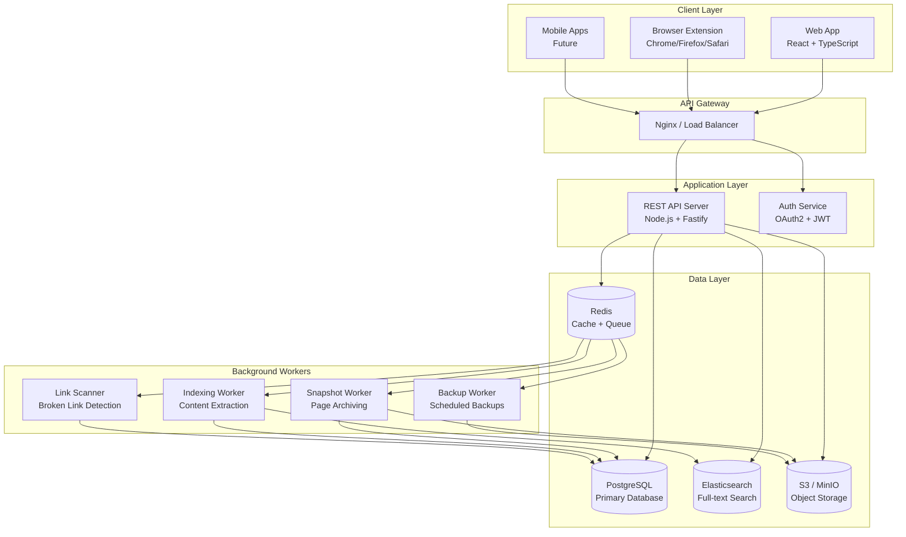
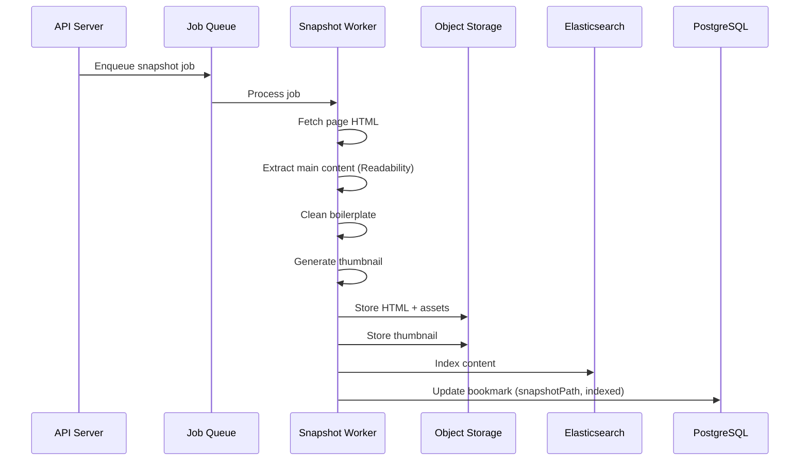
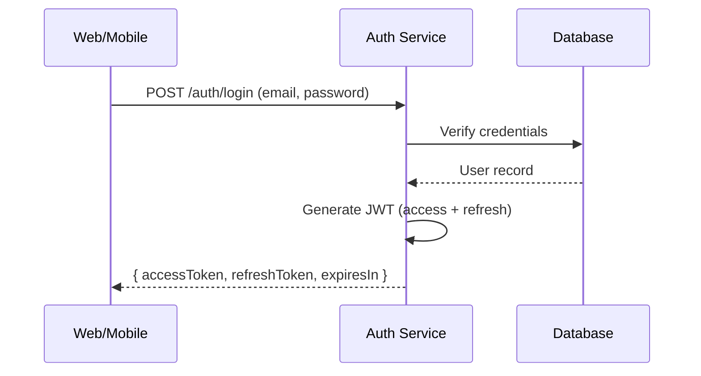
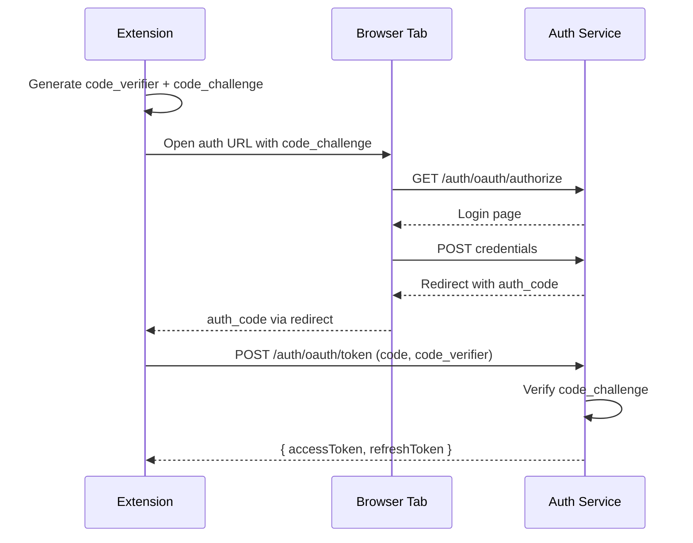

# Design Document

## Overview

The Bookmark Manager is a production-ready, cross-platform application for saving, organizing, searching, and sharing web bookmarks. The system follows a microservices-inspired architecture with clear separation between the API layer, background workers, search infrastructure, and storage systems.

The application supports both free and Pro tiers, with premium features including full-text search, permanent page archiving, highlights/annotations, and automatic backups. The system is designed for horizontal scalability, supporting millions of bookmarks across a distributed infrastructure.

## Architecture



### System Components

1. **Web Application**: React + TypeScript SPA with responsive design, four view modes, and real-time sync
2. **Browser Extension**: Cross-browser extension (Manifest V3) for quick saving, highlighting, and bulk tab operations
3. **REST API**: Fastify-based Node.js server providing OpenAPI-documented endpoints
4. **Auth Service**: OAuth2 + JWT authentication with PKCE support for public clients
5. **Background Workers**: BullMQ-based job processors for async operations
6. **PostgreSQL**: Primary relational database for structured data
7. **Redis**: Caching layer and job queue backend
8. **Elasticsearch**: Full-text search engine for content indexing
9. **S3/MinIO**: Object storage for snapshots, uploads, and backups

## Components and Interfaces

### API Server (Backend)

```typescript
// Core API Routes Structure
interface APIRoutes {
  // Authentication
  'POST /v1/auth/register': RegisterHandler;
  'POST /v1/auth/login': LoginHandler;
  'POST /v1/auth/refresh': RefreshTokenHandler;
  'POST /v1/auth/logout': LogoutHandler;
  'GET /v1/auth/oauth/authorize': OAuthAuthorizeHandler;
  'POST /v1/auth/oauth/token': OAuthTokenHandler;

  // User
  'GET /v1/user': GetUserHandler;
  'PUT /v1/user': UpdateUserHandler;
  'DELETE /v1/user': DeleteUserHandler;
  'GET /v1/user/export': ExportUserDataHandler;

  // Collections
  'GET /v1/collections': ListCollectionsHandler;
  'POST /v1/collections': CreateCollectionHandler;
  'GET /v1/collections/:id': GetCollectionHandler;
  'PUT /v1/collections/:id': UpdateCollectionHandler;
  'DELETE /v1/collections/:id': DeleteCollectionHandler;

  // Bookmarks
  'GET /v1/bookmarks': ListBookmarksHandler;
  'POST /v1/bookmarks': CreateBookmarkHandler;
  'GET /v1/bookmarks/:id': GetBookmarkHandler;
  'PUT /v1/bookmarks/:id': UpdateBookmarkHandler;
  'DELETE /v1/bookmarks/:id': DeleteBookmarkHandler;
  'POST /v1/bookmarks/bulk': BulkOperationHandler;

  // Tags
  'GET /v1/tags': ListTagsHandler;
  'POST /v1/tags/merge': MergeTagsHandler;
  'GET /v1/tags/suggestions': TagSuggestionsHandler;

  // Highlights
  'GET /v1/highlights': ListHighlightsHandler;
  'POST /v1/highlights': CreateHighlightHandler;
  'PUT /v1/highlights/:id': UpdateHighlightHandler;
  'DELETE /v1/highlights/:id': DeleteHighlightHandler;

  // Search
  'GET /v1/search': SearchHandler;

  // Import/Export
  'POST /v1/import': ImportHandler;
  'GET /v1/export': ExportHandler;

  // Backups
  'GET /v1/backups': ListBackupsHandler;
  'POST /v1/backups': CreateBackupHandler;
  'GET /v1/backups/:id/download': DownloadBackupHandler;

  // Sharing
  'POST /v1/collections/:id/share': ShareCollectionHandler;
  'DELETE /v1/collections/:id/share/:userId': RevokeShareHandler;
  'GET /v1/public/:slug': PublicCollectionHandler;
}
```

### Service Layer Interfaces

```typescript
// Bookmark Service
interface BookmarkService {
  create(userId: string, data: CreateBookmarkDTO): Promise<Bookmark>;
  findById(id: string, userId: string): Promise<Bookmark | null>;
  findByUser(userId: string, filters: BookmarkFilters): Promise<PaginatedResult<Bookmark>>;
  update(id: string, userId: string, data: UpdateBookmarkDTO): Promise<Bookmark>;
  delete(id: string, userId: string): Promise<void>;
  bulkOperation(userId: string, operation: BulkOperation): Promise<BulkResult>;
}

// Collection Service
interface CollectionService {
  create(userId: string, data: CreateCollectionDTO): Promise<Collection>;
  findById(id: string, userId: string): Promise<Collection | null>;
  findByUser(userId: string): Promise<Collection[]>;
  update(id: string, userId: string, data: UpdateCollectionDTO): Promise<Collection>;
  delete(id: string, userId: string): Promise<void>;
  share(id: string, userId: string, shareData: ShareDTO): Promise<void>;
  getPublic(slug: string): Promise<PublicCollection | null>;
}

// Search Service
interface SearchService {
  search(userId: string, query: SearchQuery): Promise<SearchResult>;
  indexBookmark(bookmark: Bookmark, content: string): Promise<void>;
  removeFromIndex(bookmarkId: string): Promise<void>;
}

// Snapshot Service
interface SnapshotService {
  createSnapshot(bookmarkId: string, url: string): Promise<Snapshot>;
  getSnapshot(bookmarkId: string): Promise<Snapshot | null>;
  generateThumbnail(url: string): Promise<string>;
}

// Highlight Service
interface HighlightService {
  create(userId: string, data: CreateHighlightDTO): Promise<Highlight>;
  findByBookmark(bookmarkId: string, userId: string): Promise<Highlight[]>;
  update(id: string, userId: string, data: UpdateHighlightDTO): Promise<Highlight>;
  delete(id: string, userId: string): Promise<void>;
  search(userId: string, query: string): Promise<Highlight[]>;
}
```

### Background Job Interfaces

```typescript
// Job Queue Types
interface SnapshotJob {
  type: 'snapshot';
  bookmarkId: string;
  url: string;
  userId: string;
}

interface IndexJob {
  type: 'index';
  bookmarkId: string;
  content: string;
  metadata: BookmarkMetadata;
}

interface BrokenLinkScanJob {
  type: 'broken-link-scan';
  userId: string;
  bookmarkIds: string[];
}

interface BackupJob {
  type: 'backup';
  userId: string;
  includeSnapshots: boolean;
}

// Worker Interface
interface JobWorker<T> {
  process(job: T): Promise<void>;
  onFailed(job: T, error: Error): Promise<void>;
}
```

## Data Models

### Database Schema (PostgreSQL)

```typescript
// User Model
interface User {
  id: string;              // UUID primary key
  email: string;           // Unique, indexed
  passwordHash: string;    // bcrypt/Argon2 hash
  name: string;
  plan: 'free' | 'pro';
  preferences: UserPreferences;
  createdAt: Date;
  updatedAt: Date;
}

interface UserPreferences {
  defaultView: ViewMode;
  theme: 'light' | 'dark' | 'system';
  defaultCollectionId?: string;
}

// Collection Model
interface Collection {
  id: string;              // UUID primary key
  ownerId: string;         // FK -> users
  title: string;
  description?: string;
  icon: string;            // Icon identifier
  color?: string;
  isPublic: boolean;
  shareSlug?: string;      // Unique when public
  sortOrder: number;
  parentId?: string;       // FK -> collections (for hierarchy)
  createdAt: Date;
  updatedAt: Date;
}

// Bookmark Model
interface Bookmark {
  id: string;              // UUID primary key
  ownerId: string;         // FK -> users
  collectionId: string;    // FK -> collections
  url: string;             // Normalized URL
  normalizedUrl: string;   // For duplicate detection
  title: string;
  excerpt?: string;
  coverUrl?: string;
  domain: string;
  type: 'link' | 'article' | 'video' | 'image' | 'document' | 'audio';
  contentSnapshotPath?: string;  // S3 path
  contentIndexed: boolean;
  isDuplicate: boolean;
  isBroken: boolean;
  isFavorite: boolean;
  sortOrder: number;
  note?: string;
  createdAt: Date;
  updatedAt: Date;
}

// Tag Model
interface Tag {
  id: string;              // UUID primary key
  ownerId: string;         // FK -> users
  name: string;            // Display name
  normalizedName: string;  // Lowercase, trimmed for matching
  color?: string;
  createdAt: Date;
}

// BookmarkTag Junction
interface BookmarkTag {
  bookmarkId: string;      // FK -> bookmarks
  tagId: string;           // FK -> tags
}

// Highlight Model
interface Highlight {
  id: string;              // UUID primary key
  bookmarkId: string;      // FK -> bookmarks
  ownerId: string;         // FK -> users
  textSelected: string;    // The highlighted text
  color: HighlightColor;
  annotationMd?: string;   // Markdown annotation
  positionContext: PositionContext;  // DOM context for re-rendering
  snapshotId?: string;     // Reference to snapshot version
  createdAt: Date;
  updatedAt: Date;
}

interface PositionContext {
  startOffset: number;
  endOffset: number;
  containerSelector: string;
  surroundingText: string;
}

type HighlightColor = 'yellow' | 'green' | 'blue' | 'pink' | 'purple';

// File Model
interface File {
  id: string;              // UUID primary key
  ownerId: string;         // FK -> users
  bookmarkId?: string;     // FK -> bookmarks (optional)
  filename: string;
  mimeType: string;
  size: number;            // Bytes
  s3Path: string;
  createdAt: Date;
}

// Backup Model
interface Backup {
  id: string;              // UUID primary key
  ownerId: string;         // FK -> users
  filePath: string;        // S3 path
  size: number;
  autoGenerated: boolean;
  createdAt: Date;
  expiresAt?: Date;
}

// CollectionPermission Model
interface CollectionPermission {
  id: string;              // UUID primary key
  collectionId: string;    // FK -> collections
  userId: string;          // FK -> users
  role: 'viewer' | 'editor';
  createdAt: Date;
}

// Reminder Model
interface Reminder {
  id: string;              // UUID primary key
  bookmarkId: string;      // FK -> bookmarks
  ownerId: string;         // FK -> users
  remindAt: Date;
  notificationSent: boolean;
  createdAt: Date;
}
```

### Search Index Schema (Elasticsearch)

```typescript
interface BookmarkSearchDocument {
  id: string;
  ownerId: string;
  collectionId: string;
  title: string;
  url: string;
  domain: string;
  excerpt: string;
  content: string;         // Full page content (Pro)
  tags: string[];
  type: string;
  createdAt: Date;
  updatedAt: Date;
}

interface HighlightSearchDocument {
  id: string;
  ownerId: string;
  bookmarkId: string;
  textSelected: string;
  annotation: string;
  createdAt: Date;
}
```

### DTOs and API Contracts

```typescript
// Create Bookmark DTO
interface CreateBookmarkDTO {
  url: string;
  collectionId?: string;
  tags?: string[];
  note?: string;
  title?: string;          // Override extracted title
}

// Bookmark Filters
interface BookmarkFilters {
  collectionId?: string;
  tags?: string[];
  type?: BookmarkType;
  domain?: string;
  dateFrom?: Date;
  dateTo?: Date;
  isFavorite?: boolean;
  isBroken?: boolean;
  search?: string;
  fulltext?: boolean;      // Pro: search in content
  page?: number;
  limit?: number;
  sortBy?: 'createdAt' | 'updatedAt' | 'title' | 'sortOrder';
  sortOrder?: 'asc' | 'desc';
}

// Search Query
interface SearchQuery {
  q: string;
  fulltext?: boolean;
  filters?: {
    collectionId?: string;
    tags?: string[];
    type?: BookmarkType;
    domain?: string;
    dateFrom?: Date;
    dateTo?: Date;
  };
  page?: number;
  limit?: number;
}

// Bulk Operation
interface BulkOperation {
  bookmarkIds: string[];
  action: 'addTags' | 'removeTags' | 'move' | 'delete' | 'favorite' | 'unfavorite';
  payload?: {
    tags?: string[];
    collectionId?: string;
  };
}

// Export Options
interface ExportOptions {
  format: 'html' | 'csv' | 'json' | 'txt';
  collectionId?: string;
  includeSnapshots?: boolean;
  includeHighlights?: boolean;
}
```


## URL Normalization

URL normalization is critical for duplicate detection and consistent storage. The system implements a deterministic normalization algorithm:

```typescript
interface URLNormalizer {
  normalize(url: string): string;
  extractDomain(url: string): string;
  removeTrackingParams(url: string): string;
}

// Normalization steps:
// 1. Parse URL and validate
// 2. Lowercase scheme and host
// 3. Remove default ports (80 for http, 443 for https)
// 4. Sort query parameters alphabetically
// 5. Remove tracking parameters (utm_*, fbclid, gclid, etc.)
// 6. Remove trailing slashes from path
// 7. Decode unnecessary percent-encoding
// 8. Remove fragment (hash) unless meaningful
```

## Content Extraction Pipeline



## Authentication Flow

### Standard Login Flow


### Browser Extension PKCE Flow


## Import/Export Formats

### HTML Bookmark Format (Netscape)
```html
<!DOCTYPE NETSCAPE-Bookmark-file-1>
<META HTTP-EQUIV="Content-Type" CONTENT="text/html; charset=UTF-8">
<TITLE>Bookmarks</TITLE>
<H1>Bookmarks</H1>
<DL><p>
    <DT><H3>Collection Name</H3>
    <DL><p>
        <DT><A HREF="https://example.com" ADD_DATE="1234567890" TAGS="tag1,tag2">Title</A>
        <DD>Description/excerpt
    </DL><p>
</DL><p>
```

### JSON Export Format
```typescript
interface ExportJSON {
  version: string;
  exportedAt: string;
  user: {
    id: string;
    email: string;
  };
  collections: ExportCollection[];
  bookmarks: ExportBookmark[];
  tags: ExportTag[];
  highlights?: ExportHighlight[];
}
```

### CSV Export Format
```
id,url,title,excerpt,collection,tags,type,createdAt
uuid,https://example.com,Title,Excerpt text,Collection Name,"tag1,tag2",article,2024-01-01T00:00:00Z
```

## Error Handling

### Error Response Format
```typescript
interface APIError {
  error: {
    code: string;           // Machine-readable error code
    message: string;        // Human-readable message
    details?: Record<string, any>;
    requestId: string;      // For debugging/support
  };
}

// Error Codes
enum ErrorCode {
  // Authentication
  INVALID_CREDENTIALS = 'AUTH_001',
  TOKEN_EXPIRED = 'AUTH_002',
  ACCOUNT_LOCKED = 'AUTH_003',
  
  // Validation
  INVALID_URL = 'VAL_001',
  MISSING_REQUIRED_FIELD = 'VAL_002',
  INVALID_FORMAT = 'VAL_003',
  
  // Resources
  NOT_FOUND = 'RES_001',
  DUPLICATE_RESOURCE = 'RES_002',
  PERMISSION_DENIED = 'RES_003',
  
  // Rate Limiting
  RATE_LIMIT_EXCEEDED = 'RATE_001',
  
  // Pro Features
  PRO_FEATURE_REQUIRED = 'PRO_001',
  STORAGE_LIMIT_EXCEEDED = 'PRO_002',
}
```

### Error Handling Strategy
- All errors return appropriate HTTP status codes (4xx for client errors, 5xx for server errors)
- Validation errors include field-level details
- Rate limit errors include retry-after header
- Internal errors are logged with full context but return sanitized messages to clients

## Testing Strategy

### Dual Testing Approach

The system employs both unit testing and property-based testing for comprehensive coverage:

**Unit Tests**: Verify specific examples, edge cases, and integration points
- API endpoint tests with mocked services
- Service layer tests with mocked repositories
- Repository tests against test database
- Component tests for React UI

**Property-Based Tests**: Verify universal properties across all valid inputs
- Use fast-check library for TypeScript property-based testing
- Each property test runs minimum 100 iterations
- Tests are tagged with corresponding correctness property references

### Testing Framework
- **Backend**: Vitest + fast-check for unit and property tests
- **Frontend**: Vitest + React Testing Library + fast-check
- **E2E**: Playwright for browser automation
- **Extension**: Jest + Puppeteer for extension testing

### Test Organization
```
/backend
  /src
    /services
      bookmark.service.ts
      bookmark.service.test.ts      # Unit tests
      bookmark.service.property.ts  # Property tests
    /repositories
      bookmark.repository.ts
      bookmark.repository.test.ts
/frontend
  /src
    /components
      BookmarkCard.tsx
      BookmarkCard.test.tsx
/tests
  /e2e
    bookmark-flow.spec.ts
  /integration
    api.integration.test.ts
```


## Correctness Properties

*A property is a characteristic or behavior that should hold true across all valid executions of a system-essentially, a formal statement about what the system should do. Properties serve as the bridge between human-readable specifications and machine-verifiable correctness guarantees.*

### Property 1: Bookmark Serialization Round-Trip

*For any* valid bookmark object, serializing to JSON and then deserializing should produce an equivalent bookmark object with all fields preserved.

**Validates: Requirements 2.7, 2.8**

### Property 2: Collection Serialization Round-Trip

*For any* valid collection object, serializing to JSON and then deserializing should produce an equivalent collection object with all fields preserved.

**Validates: Requirements 3.6, 3.7**

### Property 3: Highlight Serialization Round-Trip

*For any* valid highlight object with position context, serializing to JSON and then deserializing should produce an equivalent highlight object with position context preserved.

**Validates: Requirements 11.6, 11.7**

### Property 4: Export/Import Round-Trip (JSON Format)

*For any* set of bookmarks exported to JSON format, importing that JSON should produce an equivalent set of bookmarks with all metadata preserved.

**Validates: Requirements 8.5, 8.6**

### Property 5: URL Normalization Idempotence

*For any* URL string, normalizing it twice should produce the same result as normalizing it once (normalize(normalize(url)) === normalize(url)).

**Validates: Requirements 2.6**

### Property 6: URL Normalization Removes Tracking Parameters

*For any* URL with tracking parameters (utm_*, fbclid, gclid), the normalized URL should not contain those parameters while preserving all other query parameters.

**Validates: Requirements 2.6**

### Property 7: Tag Normalization Consistency

*For any* tag name string, normalizing it should produce a lowercase, trimmed string, and normalizing twice should produce the same result.

**Validates: Requirements 4.1**

### Property 8: Filter Results Satisfy Filter Criteria

*For any* bookmark filter query (by tags, type, domain, or date range), all returned bookmarks should satisfy all specified filter criteria.

**Validates: Requirements 4.2, 4.3, 4.4, 4.5**

### Property 9: Tag Suggestions Match Prefix

*For any* tag suggestion query with a prefix, all returned tag suggestions should start with that prefix (case-insensitive).

**Validates: Requirements 4.6**

### Property 10: Tag Merge Preserves Bookmark Count

*For any* tag merge operation, the total number of bookmarks associated with the target tag after merge should equal the sum of bookmarks from both source and target tags (minus duplicates).

**Validates: Requirements 4.7**

### Property 11: Duplicate Detection Uses Normalized URLs

*For any* two URLs that normalize to the same value, saving both should result in the second being flagged as a duplicate.

**Validates: Requirements 17.1, 17.2**

### Property 12: Bookmark Creation Populates Required Fields

*For any* valid URL submitted for bookmark creation, the resulting bookmark should have non-empty title, domain, type, ownerId, and timestamps.

**Validates: Requirements 2.1, 2.2**

### Property 13: Bookmark Deletion Removes Associated Data

*For any* bookmark with associated highlights and tags, deleting the bookmark should result in zero highlights and zero tag associations remaining for that bookmark ID.

**Validates: Requirements 2.5**

### Property 14: Collection Deletion Preserves Bookmarks

*For any* collection containing bookmarks, deleting the collection should move all contained bookmarks to the "Unsorted" collection rather than deleting them.

**Validates: Requirements 3.4**

### Property 15: Public Collection Slug Uniqueness

*For any* two collections set as public, their generated share slugs should be different.

**Validates: Requirements 3.5**

### Property 16: Bulk Operations Affect All Selected Items

*For any* bulk operation (add tags, move, delete) on a set of bookmark IDs, the operation should affect exactly those bookmarks and no others.

**Validates: Requirements 14.1, 14.2, 14.3**

### Property 17: Sort Order Persistence

*For any* manual reordering of bookmarks within a collection, fetching the bookmarks should return them in the persisted order.

**Validates: Requirements 14.4**

### Property 18: Permission-Based Access Control

*For any* shared collection with viewer role, the viewer should be able to read but not modify the collection or its bookmarks.

**Validates: Requirements 13.1, 13.4**

### Property 19: Public Collection Anonymous Access

*For any* collection marked as public with a share slug, unauthenticated requests to that slug should return the collection contents in read-only mode.

**Validates: Requirements 13.2**

### Property 20: Search Results Contain Query Terms

*For any* full-text search query, all returned bookmarks should contain the query terms in their indexed content (title, excerpt, or full content for Pro users).

**Validates: Requirements 9.3**

### Property 21: Search Filter Application

*For any* search query with filters (tags, type, domain, date range), all returned results should satisfy both the text query and all filter criteria.

**Validates: Requirements 9.5**

### Property 22: Highlight Search Returns Matches

*For any* highlight search query, all returned highlights should contain the query text in either the selected text or annotation.

**Validates: Requirements 11.4**

### Property 23: JWT Token Refresh Validity

*For any* valid refresh token, exchanging it for a new access token should produce a valid JWT that can authenticate API requests.

**Validates: Requirements 1.4**

### Property 24: PKCE Code Verifier Validation

*For any* OAuth2 PKCE flow, the token exchange should succeed only when the code_verifier matches the original code_challenge using SHA256.

**Validates: Requirements 1.3**

### Property 25: HTML Import Preserves Structure

*For any* valid Netscape bookmark HTML file, importing should create collections matching the folder hierarchy and bookmarks with correct parent collection assignments.

**Validates: Requirements 8.1**

### Property 26: Export Contains Only Filtered Bookmarks

*For any* export operation with a collection filter, the exported data should contain exactly the bookmarks from that collection and no others.

**Validates: Requirements 8.3**

